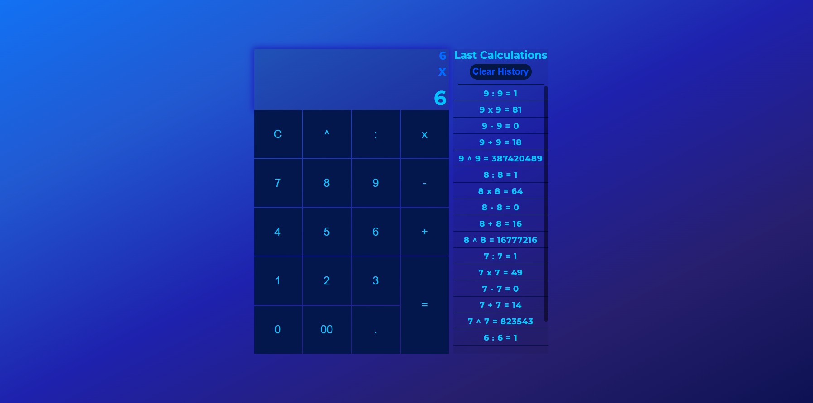

# Calculator

## Table of contents
* [About project](#about-project)
* [Versions](#versions)
* [Tutorial](#tutorial)
* [Custom scroll](#custom-scroll)
* [Screenshot](#screenshot)

## About project
This is only a simple calculator	

## Versions
Project is created with these languages:
* CSS3
* HTML5
* ECMAScript 2023

## Tutorial
I created this calculator from this tutorial:
```
https://www.youtube.com/watch?v=M1SDN7FqqNY
```

## Custom scroll
Link to custom scroll:
```
https://github.com/Grsmto/simplebar/tree/master/packages/simplebar
```

## Screenshot



